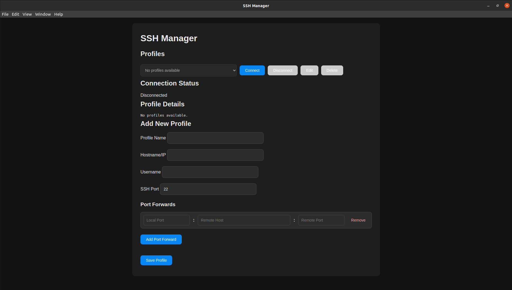

# SSH Manager

SSH Manager is a user-friendly application designed to manage SSH profiles and connections. It provides a graphical interface to simplify the process of connecting to remote servers, managing profiles, and configuring port forwards.



## Features

- **Profile Management**: Add, edit, and delete SSH profiles.
- **Connection Management**: Connect and disconnect from remote servers with ease.
- **Port Forwarding**: Configure and manage local and remote port forwards.
- **Light and Dark Themes**: Supports both light and dark themes for better usability.
- **Responsive Design**: Adapts to different screen sizes for a seamless experience.
- **Linux Binaries**: Precompiled binaries available for Linux users for easy installation.
- **.deb and .rpm Packages**: Installable packages for Debian-based and Red Hat-based distributions.

## Installation

### Using .deb or .rpm Packages

1. Download the appropriate package for your system from the [Releases](#) section.
2. Install the package:
   - For Debian-based systems (.deb):
     ```bash
     sudo dpkg -i ssh-manager.deb
     ```
   - For Red Hat-based systems (.rpm):
     ```bash
     sudo rpm -i ssh-manager.rpm
     ```
3. Launch the application from your application menu or by running:
   ```bash
   ssh-manager
   ```

### Using Linux Binaries

1. Download the latest binary from the [Releases](#) section.
2. Make the binary executable:
   ```bash
   chmod +x ssh-manager
   ```
3. Run the application:
   ```bash
   ./ssh-manager
   ```

### From Source

1. Clone the repository:
   ```bash
   git clone <repository-url>
   cd ssh-manager
   ```

2. Install dependencies:
   ```bash
   npm install
   ```

3. Start the application:
   ```bash
   npm start
   ```

## Usage

1. Launch the application.
2. Add a new profile by filling in the required details (Profile Name, Hostname/IP, Username, SSH Port, and Port Forwards).
3. Save the profile.
4. Select a profile from the dropdown and click "Connect" to establish an SSH connection.
5. Use the "Edit" or "Delete" buttons to modify or remove profiles.

## File Structure

- `index.html`: The main HTML file for the application.
- `style.css`: Contains the styles for the user interface.
- `renderer.js`: Handles the frontend logic and communication with the backend.
- `ssh_manager_backend.py`: Backend script for managing SSH connections.
- `ssh_profiles.json`: Stores the SSH profiles.
- `package.json`: Contains project metadata and dependencies.

## Development

To contribute to the project:

1. Fork the repository.
2. Create a new branch for your feature or bug fix:
   ```bash
   git checkout -b feature-name
   ```
3. Make your changes and commit them:
   ```bash
   git commit -m "Description of changes"
   ```
4. Push your changes to your fork:
   ```bash
   git push origin feature-name
   ```
5. Open a pull request.

## License

This project is licensed under the MIT License. See the `LICENSE` file for details.